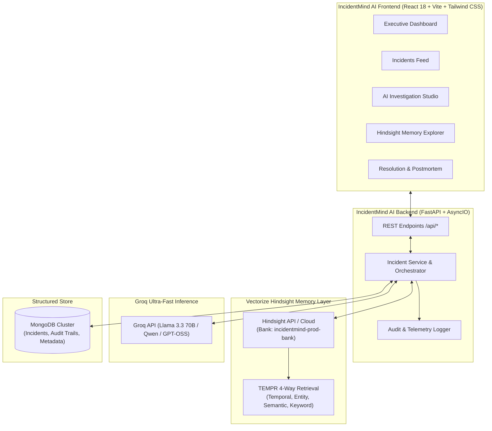

# IncidentMind AI

> Persistent-memory SRE and incident response copilot powered by Vectorize Hindsight biomimetic memory and Groq LLM inference.

[](https://fastapi.tiangolo.com)
[](https://reactjs.org)
[](https://hindsight.vectorize.io)
[](https://groq.com)

---

## 📌 Project Overview

When critical production services experience outages, on-call SREs and DevOps engineers face high-pressure investigations. Traditional LLMs operate in stateless silos: they analyze symptoms blindly, propose generic hypotheses, and forget hard-won past resolutions as soon as the session closes.

**IncidentMind AI** transforms incident triage by embedding **[Hindsight](https://github.com/vectorize-io/hindsight)**, Vectorize’s biomimetic agent memory system, directly into the incident response loop.

Instead of generic suggestions, IncidentMind AI:
1. **Recalls Historical Incidents**: Uses Hindsight’s 4-way TEMPR retrieval (Temporal, Entity, Multi-strategy, Parallel) to find prior outages with matching symptom signatures.
2. **Grounds LLM Hypotheses**: Passes recalled root causes, telemetry traces, and verified runbooks directly into Groq’s high-speed inference pipeline.
3. **Retains Confirmed Knowledge**: When a human SRE marks a root cause as verified, the postmortem outcome is retained in the Hindsight bank with complete evidence provenance.
4. **Demonstrable Before-vs-After**: Shows a live comparison of the investigation with persistent memory vs a baseline stateless LLM.

---

## 🏛 System Architecture



---

## 🚀 Key Features

- **Executive SRE Dashboard**: Track MTTR trends, active alerts, service hotspots, and recurring incident signatures recognized across deployment cycles.
- **AI Investigation Studio**: Structured diagnosis grouping causes into **Confirmed**, **Suspected**, and **Unknown**, with non-destructive diagnostic steps and referenced runbooks.
- **Memory vs No-Memory Mode**: Run side-by-side comparisons of the agent’s reasoning with vs without Hindsight memory context.
- **Hindsight Memory Explorer**: Real-time inspection of retained records, memory metadata, similarity scores, and a live audit stream of `RETAIN` and `RECALL` operations.
- **Human-in-the-Loop Postmortems**: Distinguishes exploratory hypotheses from engineer-verified root causes. Confirmed fixes are ingested into Hindsight for future recall.

---

## ⚙️ Quickstart & Local Setup

### Prerequisites
- **Python**: 3.11+
- **Node.js**: 18+ (tested on Node 25)
- **MongoDB**: (Optional; falls back automatically to an in-memory resilient store if MongoDB is not running locally).

### 1. Clone & Configure
```bash
git clone https://github.com/your-org/incidentmind-ai.git
cd incidentmind-ai
```

### 2. Backend Setup
```bash
cd backend
python -m venv venv
# Windows:
.\venv\Scripts\activate
# Linux/macOS:
source venv/bin/activate

pip install -r requirements.txt
cp .env.example .env
```
*(Optional)* Add your `HINDSIGHT_API_KEY` and `GROQ_API_KEY` to `.env`. If left empty, IncidentMind AI runs safely in high-fidelity local sandbox demo mode.

Start the backend:
```bash
uvicorn app.main:app --host 0.0.0.0 --port 8000 --reload
```
API runs at `http://localhost:8000` (Swagger docs at `/docs`).

### 3. Frontend Setup
In a new terminal:
```bash
cd frontend
npm install
npm run dev
```
Open `http://localhost:5173` in your browser.

---

## 🧪 Testing

Run the automated backend test suite (covering incident lifecycle, health readiness, and Hindsight retain/recall verification):
```bash
cd backend
python -m pytest tests -v
```

Verify frontend production build:
```bash
cd frontend
npm run build
```

---

## 📦 Deployment

- **Docker Compose**:
  ```bash
  docker-compose up --build
  ```
- **Backend on Render**: `render.yaml` included.
- **Frontend on Vercel**: `vercel.json` included.

---

## 🔗 Official References
- **Hindsight GitHub**: [https://github.com/vectorize-io/hindsight](https://github.com/vectorize-io/hindsight)
- **Hindsight Docs**: [https://hindsight.vectorize.io/](https://hindsight.vectorize.io/)
- **Vectorize Agent Memory**: [https://vectorize.io/what-is-agent-memory](https://vectorize.io/what-is-agent-memory)
