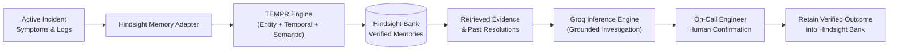

# How We Built an Incident Copilot That Never Forgets an Outage Using Hindsight

It was 2:15 AM when our payment service began dropping checkout requests with 504 Gateway Timeouts. As the on-call engineer stared at cascading HikariCP connection pool errors, a feeling of grim familiarity set in: we had debugged and resolved this exact failure three weeks earlier. Yet our team spent 40 minutes re-running the same diagnostic commands, re-checking RDS instance metrics, and tracing thread dumps before someone remembered the culprit was an unclosed JDBC statement in our webhook retry worker.

Stateless LLM chatbots promise to assist during incidents, but in reality, they reset to zero every time an incident bridge opens. They know how a generic PostgreSQL database behaves, but they know nothing about *your* architecture, your past outages, or the verified fixes your team spent hours discovering.

To break this cycle, we built **IncidentMind AI**, an SRE incident investigation copilot anchored around [Hindsight](https://github.com/vectorize-io/hindsight), an open-source agent memory system developed by Vectorize. By utilizing persistent memory instead of naive chat context, IncidentMind AI retains verified root causes and runbooks, recalling them automatically the next time similar symptoms hit production.

Here is how we architected the system, how Hindsight's memory layer transformed our incident response loop, and what we learned along the way.

---

## The Architecture: Why Traditional RAG Falls Short in Production Incidents

In standard Retrieval-Augmented Generation (RAG), engineers chunk postmortem documents into a vector database and perform cosine similarity search against an active alert. In an incident context, this breaks down rapidly:
1. **Symptom Noise**: Two completely unrelated incidents can share generic symptoms like "high CPU" or "504 Gateway Timeout". Standard vector search retrieves dozens of irrelevant postmortems.
2. **Lack of Entity & Temporal Reasoning**: An incident on `payment-api` during a high-concurrency deployment needs to link directly to recent configuration changes and service-specific dependency graphs.
3. **Hypothesis Pollution**: If every tentative Slack message or speculative hypothesis is saved into memory, future LLM responses become poisoned with false leads.

To solve this, we integrated [Hindsight](https://hindsight.vectorize.io/), which operationalizes agent memory through biomimetic operations: **Retain**, **Recall**, and **Reflect**, backed by its 4-way **TEMPR** (Temporal, Entity, Multi-strategy, and Parallel Retrieval) engine.



Structured application state, audit logs, and raw incident records remain isolated in MongoDB, while Hindsight serves as the durable semantic memory bank.

---

## Integrating Hindsight: Retain and Recall in Action

Our backend interacts with Hindsight through a dedicated adapter. When an incident is investigated, the backend extracts the active symptoms, service context, and error signatures, dispatching a structured recall query to Hindsight:

```python
# app/services/hindsight_adapter.py
async def recall(
    self,
    query: str,
    limit: int = 5,
    service: Optional[str] = None
) -> List[Dict[str, Any]]:
    """
    Recall relevant historical incident memories via Hindsight TEMPR.
    """
    if self.is_cloud_connected:
        async with httpx.AsyncClient(timeout=8.0) as client:
            headers = {
                "Authorization": f"Bearer {self.api_key}",
                "Content-Type": "application/json"
            }
            payload = {"query": query, "limit": limit}
            resp = await client.post(
                f"{self.base_url}/v1/{self.bank_id}/recall",
                json=payload,
                headers=headers
            )
            if resp.is_success:
                return self._parse_hindsight_results(resp.json())
```

Once the human on-call engineer investigates, confirms the real cause, and applies a mitigation, the resolution is permanently retained in the Hindsight bank with strict evidence provenance:

```python
# app/services/incident_service.py
memory_content = (
    f"Service: {incident.service} [{incident.environment}]. "
    f"Incident: {incident.title}. Symptoms: {', '.join(incident.symptoms)}. "
    f"Verified Root Cause: {req.verified_root_cause}. "
    f"Verification: {req.verification_method}. "
    f"Applied Resolution: {req.permanent_fix}. "
    f"Mitigation: {req.mitigation_applied}."
)

metadata = {
    "source_incident_id": incident.id,
    "service": incident.service,
    "verified_root_cause": req.verified_root_cause,
    "permanent_fix": req.permanent_fix,
    "is_verified": True
}

await hindsight_adapter.retain(
    content=memory_content,
    context=f"incident_postmortem_{incident.service}",
    metadata=metadata,
    source_incident_id=incident.id
)
```

By ensuring that only human-confirmed facts are retained, we prevent AI hallucinations from compounding into subsequent incidents.

---

## Concrete Impact: Memory vs. No-Memory in Action

To verify the tangible benefit of persistent memory, we implemented a side-by-side comparison mode in IncidentMind AI, evaluating how the same LLM diagnoses an identical incident with and without Hindsight memory.

### Scenario: Recurrent Connection Starvation
- **Service**: `payment-api`
- **Symptoms**: `HTTP 504 Gateway Timeout`, `p99 latency > 4000ms`
- **Error**: `HikariPool-1 - Connection is not available, request timed out after 30000ms`

### 1. Without Hindsight (Baseline Stateless Model)
The baseline model produced broad, exploratory suggestions:
- *Hypotheses*: Generic database overload, network partition, or unindexed queries.
- *Recommended Steps*: Check AWS RDS CPU metrics, run EXPLAIN on slow query logs, restart the pod cluster.
- *Verdict*: Useful for a junior developer, but misses the institutional knowledge already solved three weeks ago.

### 2. With Hindsight Persistent Memory
When Hindsight's memory bank was queried, TEMPR immediately retrieved incident `INC-8F42A1` from earlier in the month:
- *Recalled Cause*: Unclosed JDBC statements in the webhook worker thread pool coupled with RDS `max_connections` ceiling.
- *Prescribed Fix*: Run `pg_stat_activity` to inspect queries in `idle in transaction` state originating from the worker pool, and deploy the `pgbouncer` sidecar proxy configuration.
- *Confidence*: High certainty grounded in source incident `INC-8F42A1`.

The difference in triage velocity was stark: instead of spending 30 minutes ruling out slow queries and network drops, the engineer verified the exact unclosed statement trace within 2 minutes.

---

## Lessons Learned Building with Agent Memory

1. **Memory Provenance is Mandatory**: Engineers do not trust opaque AI assertions. Displaying the exact source incident ID, author, and verification timestamp from Hindsight was critical to engineer adoption.
2. **Never Treat Hypotheses as Facts**: Early iterations allowed the agent to retain its own speculative diagnoses. This created a feedback loop where speculative causes were treated as established facts. We enforced a strict human-in-the-loop gate before any memory retention call.
3. **Structured Schemas Beat Conversational Text**: Triage bridges require crisp tables: Confirmed Causes, Suspected Causes, and Safe Reversible Diagnostic Steps. Forcing strict JSON schema outputs on top of retrieved memories removed ambiguity.

To explore the memory concepts that make this possible, review the [Vectorize agent memory documentation](https://vectorize.io/what-is-agent-memory) and check out the open-source repository at [Hindsight on GitHub](https://github.com/vectorize-io/hindsight).
