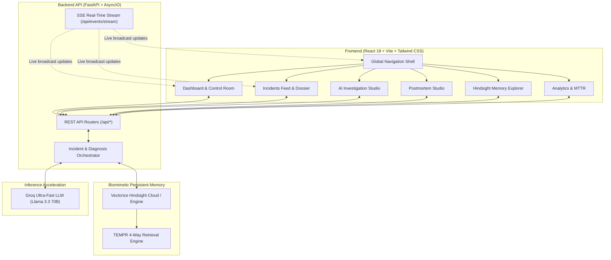

# IncidentMind AI — Complete End-to-End User Manual & Live Real-Time Demo Guide

> **Persistent-Memory Incident Response Platform for SRE, DevOps, and Operations Teams**  
> Powered by **Vectorize Hindsight** Biomimetic Agent Memory, **Groq** Ultra-Fast LLM Inference, and **FastAPI** Real-Time Event Streaming.

---

## 📑 Table of Contents

1. [Executive Overview & Architecture](#1-executive-overview--architecture)
2. [Global Navigation & Shell Components](#2-global-navigation--shell-components)
3. [Full End-to-End Live Incident Demo (The SRE Journey)](#3-full-end-to-end-live-incident-demo-the-sre-journey)
   - [Step 1: Public Showcase & Launching Console (`/landing`)](#step-1-public-showcase--launching-console-landing)
   - [Step 2: Declaring an Incident (`CreateIncidentModal`)](#step-2-declaring-an-incident-createincidentmodal)
   - [Step 3: Executive SRE Dashboard (`/dashboard`)](#step-3-executive-sre-dashboard-dashboard)
   - [Step 4: Incidents Feed & Multi-Dimensional Triage (`/incidents`)](#step-4-incidents-feed--multi-dimensional-triage-incidents)
   - [Step 5: Incident Dossier & Lifecycle Management (`/incident-detail`)](#step-5-incident-dossier--lifecycle-management-incident-detail)
   - [Step 6: AI Investigation Studio & SRE Copilot (`/investigation`)](#step-6-ai-investigation-studio--sre-copilot-investigation)
   - [Step 7: Resolution & Knowledge Retention (`/postmortem`)](#step-7-resolution--knowledge-retention-postmortem)
   - [Step 8: After-Action Reports (`/after-action`)](#step-8-after-action-reports-after-action)
   - [Step 9: Improvement Items & Preventative Action Backlog (`/improvements`)](#step-9-improvement-items--preventative-action-backlog-improvements)
   - [Step 10: Knowledge Base & Memory Explorer (`/memory-explorer`)](#step-10-knowledge-base--memory-explorer-memory-explorer)
   - [Step 11: Incident Archive & Historical Search (`/history`)](#step-11-incident-archive--historical-search-history)
   - [Step 12: Reliability Analytics & MTTR Benchmark (`/analytics`)](#step-12-reliability-analytics--mttr-benchmark-analytics)
   - [Step 13: System Settings & Health Monitor (`/settings`)](#step-13-system-settings--health-monitor-settings)
4. [Component-by-Component Functional Reference](#4-component-by-component-functional-reference)
5. [Keyboard Shortcuts & Rapid On-Call Operations](#5-keyboard-shortcuts--rapid-on-call-operations)

---

## 1. Executive Overview & Architecture

### The Problem
During production outages, Site Reliability Engineers (SREs) and on-call responders operate under intense pressure. Traditional AI assistants operate in **stateless silos**: they analyze symptoms blindly, hallucinate theoretical causes, and immediately forget hard-won past fixes the moment the incident chat closes.

### The Solution: IncidentMind AI
IncidentMind AI embeds **Vectorize Hindsight** biomimetic memory directly into the incident command loop:
1. **Recalls Historical Context**: Automatically queries past postmortems, known failure signatures, and runbooks via Hindsight's 4-way **TEMPR** retrieval (Temporal, Entity, Multi-strategy, Parallel).
2. **Grounds Groq LLM Diagnostics**: Combines current real-time telemetry with historical evidence to synthesize high-confidence, actionable root-cause hypotheses.
3. **Retains Verified Solutions**: When an engineer resolves the incident and writes a postmortem, confirmed outcomes are retained back into Hindsight persistent memory—preventing repeated troubleshooting when the same failure pattern recurs.

---

## 2. Global Navigation & Shell Components

The global shell surrounds every page in IncidentMind AI to ensure immediate situational awareness and seamless navigation during an active outage:

### A. The Sidebar (`Sidebar.tsx`)
- **Brand Identity (`IRHQ AI`)**: Clicking the logo navigates instantly to the Executive Dashboard.
- **Collapse / Expand Toggle (`ChevronLeft`)**: Toggles between a compact 18-column icon bar and a detailed 64-column navigation drawer.
- **Navigation Tabs**:
  - `Home`: Overview dashboard and active incident status.
  - `Incidents`: Live incident list with an active status badge.
  - `After Action Reports`: High-level executive post-incident summaries.
  - `Improvement Items`: Preventative engineering action backlog.
  - `Analytics`: MTTR benchmarks and recurring failure patterns.
  - `Knowledge Base`: Direct access to the Hindsight persistent memory bank.
  - `Settings`: Integration health and service configuration.
- **Product Overview Link**: Jumps to the public interactive showcase page.
- **Theme Switcher (`ThemeToggle.tsx`)**: High-contrast toggle switching between Light Mode (`#FFFFFF` background, `#172033` typography) and Dark Mode (`#0E1117` background, `#F1F5F9` typography).
- **SRE Profile / Authentication (`ClerkAuthControl.tsx`)**: Displays logged-in responder identity or Clerk authentication state.
- **Systems Operational Pill**: Real-time indicator showing engine and database operational state.

### B. The Top Navbar (`Navbar.tsx`)
- **Breadcrumbs Navigator**: Displays current module context (e.g. `IRHQ / AI Investigation Studio`).
- **Global Search (`⌘K` / `/`)**: Rapid search across incident titles, error messages, CVEs, runbooks, and memory IDs.
- **Real-Time SSE Live Telemetry Indicator**: A green pulsing badge connected to `/api/events/stream`. Whenever any incident is declared, updated, or analyzed anywhere in the system, a Server-Sent Event broadcasts to all active tabs without requiring a manual browser refresh.
- **Alerts Bell**: Displays incoming alerts and incident threshold warnings.
- **`+ New Incident` Button**: Primary call-to-action that opens the Incident Declaration modal from anywhere in the app.

---

## 3. Full End-to-End Live Incident Demo (The SRE Journey)

Follow this step-by-step walkthrough demonstrating a complete, real-time live incident triage scenario:

---

### Scenario:
> **"Payment Gateway Database Connection Pool Exhaustion & Spike in 504 Gateway Timeouts under Peak Traffic"**

---

### Step 1: Public Showcase & Launching Console (`/landing`)
**What It Is:**  
The public entry point and architectural demonstration of IncidentMind AI.

**Key Components:**
- **Hero Banner**: Highlights the difference between standard stateless AI and persistent-memory SRE intelligence.
- **`Launch Incident Console` Button**: Transitions directly into the active SRE command workspace (`/dashboard`).
- **`Declare Incident` Secondary CTA**: Immediately launches the incident creation modal.
- **The Intelligence Cycle Grid**: Visually diagrams the 4-phase cycle: Detect $\rightarrow$ Triage $\rightarrow$ Investigate $\rightarrow$ Retain.
- **Platform Capability Cards**: Explains fast root-cause identification, human-in-the-loop verification, and recurring failure signature clustering.

**User Action in Demo:**  
Click **"Launch Incident Console"** to enter the live command room.

---

### Step 2: Declaring an Incident (`CreateIncidentModal`)
**What It Is:**  
The fast incident ingestion dialog designed for rapid capture during high-stress outages.

**Key Components & How to Use Them:**
1. **Scenario Presets Bar**:
   - Located at the top of the modal. Provides one-click presets for common outages:
     - `PostgreSQL Conn Pool` (Database connection exhaustion)
     - `Kafka Consumer Lag` (Pipeline latency & rebalance storms)
     - `Redis OOM Crash` (Cache eviction failures)
     - `Stripe API Timeout` (Payment provider upstream degradation)
   - *Clicking a preset automatically populates the title, affected service, severity, symptoms, and realistic stack traces.*
2. **Title Field**: Short, descriptive summary (e.g., `Payment Gateway 504 Gateway Timeouts - DB Conn Pool Exhaustion`).
3. **Service Selector**: Dropdown to categorize the microservice (`payment-service`, `auth-service`, `order-processing`, `checkout-api`, etc.).
4. **Severity Selector**: Priority classification:
   - `Critical (P0)`: Complete service outage affecting revenue or user logins.
   - `High (P1)`: Major degradation with active customer impact.
   - `Medium (P2)`: Partial performance drop with redundancy active.
   - `Low (P3)`: Non-critical diagnostic anomaly or warning.
5. **Symptoms / Diagnostic Description**: Textarea for logs, error codes, and customer-facing impact statements.
6. **Diagnostic Evidence & Raw Logs**: Textarea to paste stacktraces, log lines, or curl outputs (e.g., `FATAL: remaining connection slots are reserved for non-replication superuser connections`).
7. **Action Buttons**:
   - `Cancel`: Discards and closes the modal.
   - `Declare Incident & Run AI Investigation`: Submits `POST /api/incidents` to the backend. The backend persists the incident, triggers real-time SSE broadcasts, initiates Hindsight memory retrieval, invokes Groq LLM synthesis, and automatically routes the user to the incident dossier.

---

### Step 3: Executive SRE Dashboard (`/dashboard`)
**What It Is:**  
The operational command center providing real-time situational awareness across all enterprise services.

**Key Components & Live Functions:**
1. **Active Incidents Severity Strip**:
   - Six high-contrast metric cards derived from live backend records: `Total`, `Info`, `Low`, `Medium`, `High`, and `Critical`.
   - Each card displays real counts and distinct color-coded left accent stripes.
2. **Real-Time Carousel of Active Incidents**:
   - Displays all active outages in a horizontal, scrollable card deck.
   - Each card highlights:
     - Incident ID and Title.
     - Affected Service category pill.
     - Severity badge with dynamic color borders.
     - Live Status badge (`Investigating`, `Mitigated`, `Resolved`).
     - Assigned responder name.
     - Relative timestamp of creation.
     - Quick-Action buttons: **"Investigate"** (jumps directly into AI Investigation Studio) and **"View Dossier"** (opens the deep lifecycle view).
3. **Service Health Matrix Table**:
   - Summarizes incident distribution across microservices.
   - Tracks counts across lifecycle states: `Reported`, `Investigating`, `Responding`, `Contained`, and `Recovering`.
4. **Visual Intelligence Hub**:
   - Three-tab switcher allowing the operator to toggle views without leaving the dashboard:
     - `SRE Command Control`: High-level operational metrics.
     - `Hindsight Memory Bank`: Quick preview of active memory counts and knowledge nodes.
     - `AI Root Cause Synthesis`: Instant preview of the latest automated diagnosis.

**User Action in Demo:**  
Locate the newly declared Payment Gateway incident in the carousel and click **"Investigate"** to enter the AI Investigation Studio.

---

### Step 4: Incidents Feed & Multi-Dimensional Triage (`/incidents`)
**What It Is:**  
The complete searchable incident database allowing on-call teams to filter, sort, and manage multiple concurrent outages.

**Key Components & How to Use Them:**
1. **Search Input Bar**: Real-time filtering by incident ID, title, or service name.
2. **Status Filter Tabs**:
   - `All`: View total historical and active incident volume.
   - `Investigating`: Focus on active, unmitigated outages.
   - `Mitigated`: Incidents where temporary fixes or failovers are active.
   - `Resolved`: Verified closed incidents with completed postmortems.
3. **Dropdown Filter Bar**:
   - `Service Filter`: Narrow down to a single service (`payment-service`, `auth-service`, etc.).
   - `Severity Filter`: Filter by `Critical`, `High`, `Medium`, or `Low`.
   - `Assignee Filter`: Filter incidents assigned to yourself or specific engineers.
   - `Sort Order`: Sort by Newest, Oldest, or Severity level.
4. **Interactive Incident Table**:
   - Columns: Incident ID, Severity Badge, Incident Title & Description snippet, Service Tag, Status Badge, Assignee Avatar, Created Timestamp, and Action button (`View`).
5. **Pagination Controls**: Navigate across pages of incidents with configurable page sizes.

---

### Step 5: Incident Dossier & Lifecycle Management (`/incident-detail`)
**What It Is:**  
The definitive single-incident record tracking all metadata, diagnostic evidence, AI findings, and the immutable audit trail.

**Key Components & How to Use Them:**
1. **Incident Header Card**:
   - Displays Title, Incident ID, Affected Service, Severity badge, and Current Status badge.
2. **Quick Controls Action Toolbar**:
   - `Status Dropdown`: Change status between `Investigating`, `Mitigated`, `Resolved`, and `Closed` instantly.
   - `Severity Dropdown`: Elevate or de-escalate severity as more evidence emerges.
   - `Assignee Dropdown`: Assign on-call responders (e.g., `Dhanush SRE`, `Alex Chen`, `DevOps Team`).
   - `Reopen Incident Button`: Appears on resolved incidents to reopen them if symptoms recur, requiring a recorded reopening justification.
3. **Lifecycle Navigation Tabs**:
   - **`Symptoms & Diagnostics`**:
     - Displays the original incident description.
     - Code block containing raw telemetry, stack traces, and error outputs with an interactive **"Copy Logs"** button.
   - **`AI Investigation Findings`**:
     - Summarizes the primary root-cause hypothesis and confidence rating.
     - Shows direct links to recalled historical memory records.
     - Contains a direct CTA button: **"Open Full AI Studio"**.
   - **`Postmortem & Resolution`**:
     - For resolved incidents, displays the confirmed root cause, timeline, and permanent fix.
     - If unresolved, displays a CTA button: **"Conduct Postmortem & Retain Knowledge"**.
   - **`Timeline & Audit Trail`**:
     - Immutable, chronological ledger recording every state change, status transition, reassignment, and analysis execution with precise timestamps and actor names.
   - **`SRE Notes & Handoff`**:
     - Interactive note composer where on-call engineers write shift handoffs, hypotheses, and diagnostic observations. Notes are timestamped and permanently attached to the incident record.

---

### Step 6: AI Investigation Studio & SRE Copilot (`/investigation`)
**What It Is:**  
The core investigative engine where persistent Hindsight memory and Groq LLM inference collaborate with human engineers.

**Key Components & Live Functions:**
1. **Incident Selector Dropdown**:
   - Switch between active incidents without returning to the feed.
2. **"Compare with Baseline (No Memory)" Toggle**:
   - **Crucial Educational & Auditing Feature**:
   - In standard mode (**With Persistent Memory**), the Groq LLM receives recalled Hindsight memories from prior outages. It provides high-confidence, service-specific root causes and references verified past runbooks.
   - In baseline mode (**Stateless LLM**), memory context is withheld. The LLM produces generic suggestions and cannot reference past internal postmortems.
   - A benchmark comparison card visually displays:
     - *MTTR Reduction*: Typically 70%+ faster resolution with persistent memory.
     - *Hallucinations Eliminated*: 0% with grounded Hindsight facts.
     - *Recalled Context*: Exact past incident IDs retrieved from the memory bank.
3. **Agentic Synthesis Card**:
   - **Primary Root Cause Hypothesis**: High-confidence explanation (e.g., *HikariCP connection pool exhausted due to unclosed database connections in payment capture webhook*).
   - **Confidence Score Badge**: Percentage calculated by the diagnostic engine.
   - **Failure Signature**: Canonical failure pattern tag (e.g., `SIG-DB-POOL-EXHAUSTION`).
   - **Impact Assessment**: Summary of affected customer flows and services.
4. **Ranked Root Cause Hypotheses Cards**:
   - Ranked secondary and tertiary hypotheses with confidence bars, supporting evidence, and diagnostic justification.
5. **Interactive SRE Diagnostic Checklist**:
   - Step-by-step verification checklist for on-call engineers.
   - *Example Checks*:
     - `[ ] Query pg_stat_activity to identify connection states and idle transactions`
     - `[ ] Verify HikariCP maximumPoolSize and leakDetectionThreshold in application.yml`
     - `[ ] Inspect connection acquisition wait times on Prometheus / Grafana metrics`
   - Engineers can check off items as they verify them in production.
6. **Recommended Mitigations & Remediation Plan**:
   - Prioritized operational runbook:
     - *Immediate Workaround*: Restart leaking pods or temporarily scale connection pooler capacity.
     - *Configuration Adjustment*: Enable `leakDetectionThreshold = 2000` to catch leaked connections.
     - *Long-Term Fix*: Enforce `try-with-resources` pattern across transaction handlers.
7. **Recalled Hindsight Memories Panel**:
   - Displays real cards of past incidents recalled from Hindsight persistent memory with:
     - Past Incident ID (e.g. `INC-2024-088`).
     - Semantic Similarity Score (e.g. `94% Match`).
     - Past Confirmed Root Cause.
     - Past Verified Resolution.
8. **Interactive SRE Copilot Chat**:
   - SREs can type natural language questions into the prompt bar:
     - *“What connection pool settings resolved INC-2024-088?”*
     - *“Give me the exact SQL query to terminate idle connections in PostgreSQL.”*
   - Groq LLM infers the answer grounded directly in the recalled Hindsight memories.

**User Action in Demo:**  
Verify the diagnostic checklist, review the recalled past incident, and click **"Resolve Incident & Conduct Postmortem"** to transition to the Postmortem Studio.

---

### Step 7: Resolution & Knowledge Retention (`/postmortem`)
**What It Is:**  
The human-in-the-loop verification studio where the incident is closed and hard-won knowledge is ingested into Hindsight persistent memory.

**Key Components & Live Functions:**
1. **Target Incident Selector**:
   - Dropdown to choose which incident is being resolved.
2. **Guided Postmortem Form**:
   - **Root Cause Classification Dropdown**: Select canonical category (`Architecture`, `Configuration`, `Capacity & Scaling`, `Software Defect`, `Network & Infrastructure`).
   - **Executive Summary & Customer Impact**: Brief retrospective narrative.
   - **Incident Timeline**: Chronological log of detection, diagnosis, failover, and recovery.
   - **Contributing Factors**: Secondary conditions that contributed to the outage (e.g., sudden traffic surge, lack of connection pool metrics).
   - **Permanent Resolution Applied**: The verified technical fix that stabilized production.
   - **Lessons Learned & Preventative Recommendations**: Architectural changes needed to prevent recurrence.
3. **"Retain into Hindsight Persistent Memory" Engine**:
   - Clicking **"Retain Knowledge & Close Incident"** triggers:
     - Status update of incident to `Resolved`.
     - Creation of a structured Postmortem record.
     - Calling `POST /api/memory/retain` to serialize the failure signature, verified root cause, and remediation steps into the Vectorize Hindsight cloud bank.
   - A live **Knowledge Preservation Animation** displays the newly generated memory ID, confirmation badge, and timestamp.

---

### Step 8: After-Action Reports (`/after-action`)
**What It Is:**  
Executive retrospectives and post-incident reporting for engineering leaders, VP of Infrastructure, and compliance auditors.

**Key Components:**
- **Incident Summary Cards**: Overview of resolved outages.
- **Reliability Metrics**: MTTA (Mean Time to Acknowledge), MTTD (Mean Time to Detect), and MTTR (Mean Time to Resolve).
- **Executive Retrospective Notes**: Impact analysis and postmortem summaries.
- **Deep Links**: Direct jump back to the full incident dossier.

---

### Step 9: Improvement Items & Preventative Action Backlog (`/improvements`)
**What It Is:**  
Action item tracker ensuring lessons learned from incidents turn into completed engineering tickets rather than forgotten postmortem documents.

**Key Components:**
- **Action Item Cards**: Preventative engineering tasks derived from incident postmortems (e.g., *“Deploy PgBouncer connection pooler in front of RDS cluster”*).
- **Priority Badges**: `P0` (Blocker), `P1` (High Priority), `P2` (Medium Priority).
- **Status Checkbox**: Mark items as `Open`, `In Progress`, or `Completed`.
- **Assignee Avatars**: Displays the owner responsible for the engineering task.
- **Originating Incident Badge**: Links directly to the incident that created the task.

---

### Step 10: Knowledge Base & Memory Explorer (`/memory-explorer`)
**What It Is:**  
The visual inspector for the Hindsight persistent memory bank.

**Key Components:**
1. **Memory Bank Statistics Strip**:
   - Displays real-time counts for `Total Memories`, `Failure Signatures`, `Runbooks`, and `Mitigations`.
2. **Memory Type Filter Pills**:
   - Filter records by memory category:
     - `failure_signature`: Symptom clusters and error fingerprints.
     - `mitigation`: Verified operational runbooks and fixes.
     - `postmortem`: Comprehensive retrospective documents.
     - `architecture`: Service topology and infrastructure constraints.
3. **Semantic & Lexical Search Input**:
   - Query memories using natural language or error codes (e.g., `HikariCP`, `connection timeout`, `Kafka lag`).
4. **Memory Detail Cards**:
   - Shows Memory ID, Type badge, Confidence rating, Source Incident ID, and summary of the learned principle.
5. **Raw JSON Inspector Modal**:
   - Clicking **"View Raw Memory"** opens a high-contrast modal displaying the full Vectorize Hindsight document schema, metadata, and vector embeddings.

---

### Step 11: Incident Archive & Historical Search (`/history`)
**What It Is:**  
Searchable repository of all historical, resolved, and closed incidents across the company's operational lifetime.

**Key Components:**
- **Global Archive Search**: Search across historical incident titles, resolutions, and tickets.
- **Service Dropdown Filter**: Filter historical records by affected service.
- **Historical Incident Cards**: Displays resolved date, confirmed root cause, verified fix summary, and postmortem ticket ID.

---

### Step 12: Reliability Analytics & MTTR Benchmark (`/analytics`)
**What It Is:**  
Quantitative analytics measuring organizational reliability and demonstrating the tangible business impact of persistent AI memory.

**Key Components:**
1. **MTTR Benchmark Comparison Banner**:
   - Contrasts average MTTR **Without Persistent Memory** (e.g., 42 minutes) versus **With IncidentMind AI Hindsight Memory** (e.g., 11 minutes), calculating a **74% resolution speedup**.
2. **Daily Incident Volume Chart**:
   - Interactive Recharts bar visualization showing incident frequency over time.
3. **Severity & Service Distribution Charts**:
   - Breakdown of incident volume across severity levels and microservices.
4. **Recurring Failure Signature Clusters**:
   - AI-detected clusters of repeat failure patterns across deployments (e.g., `SIG-CONN-LEAK`, `SIG-REDIS-EVICTION`), warning engineers before recurring anomalies cause major outages.

---

### Step 13: System Settings & Health Monitor (`/settings`)
**What It Is:**  
The administrative control plane verifying all infrastructure connections and operational parameters.

**Key Components:**
1. **Live Connection Health Indicators**:
   - `Backend API`: Healthy (`FastAPI v1.0.0`)
   - `Hindsight Cloud Engine`: Connected (`Bank: incidentmind-prod-bank`)
   - `Groq LLM Inference`: Online (`Model: Llama-3.3-70b-versatile`)
   - `Storage Layer`: Connected (MongoDB / Resilient Store)
   - `Real-Time SSE Stream`: Connected & Active (`/api/events/stream`)
2. **LLM Model Parameters**:
   - Configure model provider, temperature, and maximum token output.
3. **Integrations & Webhooks**:
   - View connected Slack channels, alert webhooks, and PagerDuty endpoints.
4. **Audit Log & Retention Configuration**:
   - Enforce regulatory compliance and immutable audit logging policies.

---

## 4. Component-by-Component Functional Reference

| UI Component | File Location | Key Purpose | Primary Actions / Interactions |
| :--- | :--- | :--- | :--- |
| **`Sidebar`** | `components/Sidebar.tsx` | Main navigation & shell drawer | Switch tabs, collapse/expand, toggle dark/light theme, view Clerk user profile. |
| **`Navbar`** | `components/Navbar.tsx` | Top breadcrumbs & global actions | Global search, live SSE status monitor, declare incident trigger, notification alerts. |
| **`CreateIncidentModal`** | `components/CreateIncidentModal.tsx` | Outage declaration modal | Select scenario presets, specify service, severity, paste logs, declare incident. |
| **`Dashboard`** | `pages/Dashboard.tsx` | Executive SRE command cockpit | Active severity strip, live incident carousel, service health matrix, visual hub switcher. |
| **`IncidentList`** | `pages/IncidentList.tsx` | Full incident table & triage | Search, filter by status/service/severity/assignee, sort, paginate, navigate to dossier. |
| **`IncidentDetail`** | `pages/IncidentDetail.tsx` | Comprehensive incident record | Change status/severity/assignee, view logs, view AI summary, reopen modal, write SRE notes. |
| **`InvestigationWorkspace`**| `pages/InvestigationWorkspace.tsx`| AI-driven investigation studio | Re-run analysis, compare memory vs baseline, diagnostic checklist, SRE Copilot chat. |
| **`Postmortem`** | `pages/Postmortem.tsx` | Root cause resolution & retention | Classify root cause, document timeline, retain lessons learned into Hindsight memory. |
| **`AfterActionReports`** | `pages/AfterActionReports.tsx` | Executive retrospective view | Review incident duration, MTTR metrics, executive postmortem summaries. |
| **`ImprovementItems`** | `pages/ImprovementItems.tsx` | Preventative engineering tracker | Track post-incident action items, toggle completed state, view assignees and priorities. |
| **`MemoryExplorer`** | `pages/MemoryExplorer.tsx` | Hindsight memory bank browser | Filter by memory type, semantic search, inspect memory cards, open raw JSON modal. |
| **`IncidentHistory`** | `pages/IncidentHistory.tsx` | Long-term incident archive | Search past resolved incidents, filter by service, review past postmortems. |
| **`AnalyticsPage`** | `pages/AnalyticsPage.tsx` | Reliability & MTTR analytics | View MTTR comparison banner, daily incident volume chart, recurring signature clusters. |
| **`SettingsPage`** | `pages/SettingsPage.tsx` | Health checks & configurations | Inspect live connection status for Hindsight, Groq, Backend, and Real-time SSE. |
| **`LandingPage`** | `pages/LandingPage.tsx` | Public overview & showcase | Launch console, explore intelligence cycle, view architecture and capability cards. |
| **`ThemeToggle`** | `components/ThemeToggle.tsx` | Dark/Light mode switcher | Seamlessly toggle HTML root class `dark` with automatic high-contrast palette update. |
| **`ClerkAuthControl`** | `components/ClerkAuth.tsx` | SRE user session manager | Sign in, sign out, switch profiles, view active engineer avatar and email. |

---

## 5. Keyboard Shortcuts & Rapid On-Call Operations

| Shortcut | Action | Where Active |
| :--- | :--- | :--- |
| `⌘ + K` or `/` | Focus Global Search Input | Anywhere in the application |
| `Esc` | Close open Modal (Declare Incident, Raw Memory JSON, Reopen Dialog) | Active Modals |
| `Enter` | Submit SRE Copilot Question in AI Studio | Investigation Workspace Chat Prompt |
| `Alt + T` | Toggle Light / Dark Theme | Application Shell |

---

*IncidentMind AI Documentation • Production SRE Manual • Vectorize Hindsight & Groq LLM*
